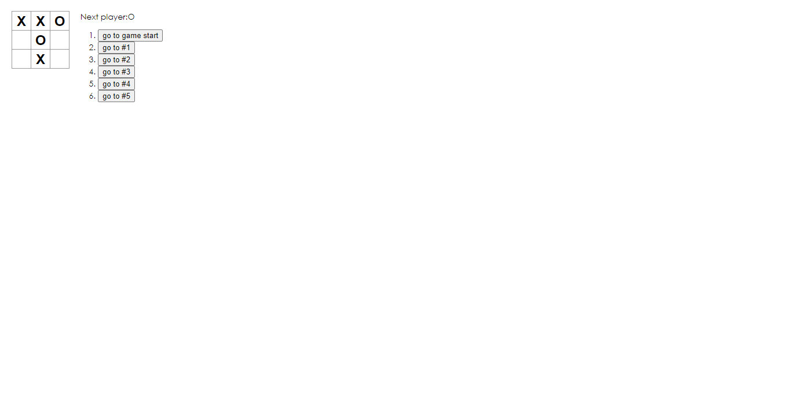

# tic-tac-toe-React
 This is a game built using React guides. It is a two players game. player with right combinations of X or O wins. 
#  Roll Dice

<p align="center">
    
</p>

## Live version of the production comming soon


### Feature Currently available:

* Switch page to see data

## Tech used 
* Html
* CSS (Meterilize)
* JavaScript
* React

## External library 

* Webpack
* css-loader
* sass-loader
* file-loader
* create-react-app


## Using the app in development 
Clone this repo (you need Node js installed in your computer).
```
$ https://github.com/TashfeenRao/tic-tac-toe-React.git
```

 Change to the app directory 
 
 ```
$ cd tic-tac-toe-React
 ```

   And run 

```
$ npm install 
```

To start the server you don't need other special server you can go to the project folder ans click the index.html or install live server extention if you're using vsCode

## Author 

* Tashfeen Rao    Github : https://github.com/TashfeenRao
## Contribution 

If you want to contribute to this project you're welcome .
Follow the github code of conduct fork this repo and open your pull request. 
